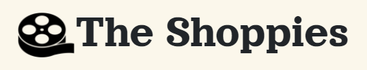
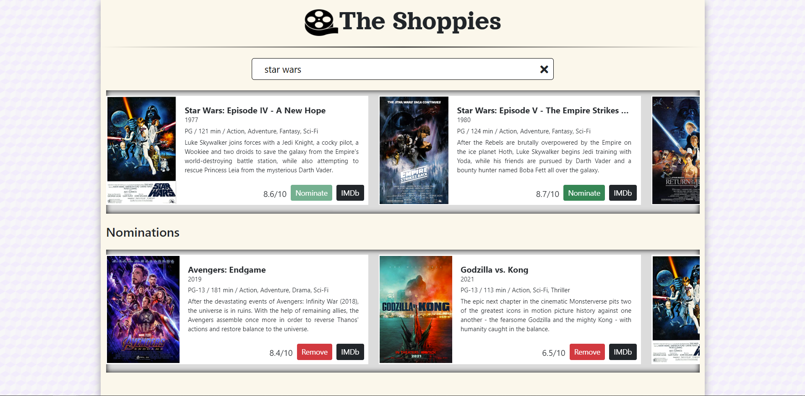

<!-- PROJECT LOGO -->
<br />
<p align="center">
  <a href="https://shopifyawards.netlify.app/">
    
  </a>
</p>

Demo: https://shopifyawards.netlify.app/

Webpage that can search OMDB for movies, and allow the user to save their favourite films they feel should be up for nomination. Users can select up to 5 nominess and are notified they're finished.

## Motivation

To showcase my Front-End development skills, via React, for the Shopify Web Developer Intern Challenge - Fall 2021.

## Features

- **Search**: Search the OMDB database and display the results.
- **Nominate**: Add a movie from the search results to nomination list.
- **View Nominations**: View the list of films already nominated (5 max).
- **Remove Nomination**: Remove a nominee from the nomination list.
- Responsive User Interface.

## Built With

- [React](https://reactjs.org/)
- [Bootstrap](https://getbootstrap.com)

## Installation

```bash
# get the project
$ git clone https://github.com/shivamp08/theshoppies

# install dependencies
$ npm install

# run start (using react-scripts - default port: 3000)
$ npm start

```

## Screenshot


